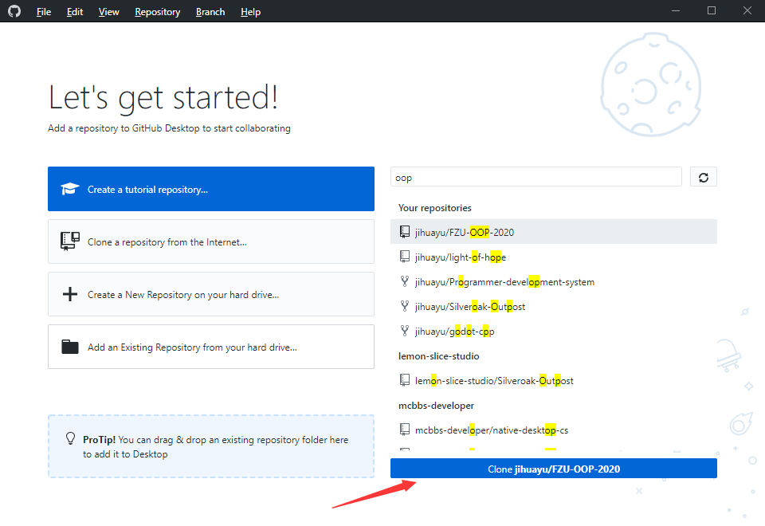
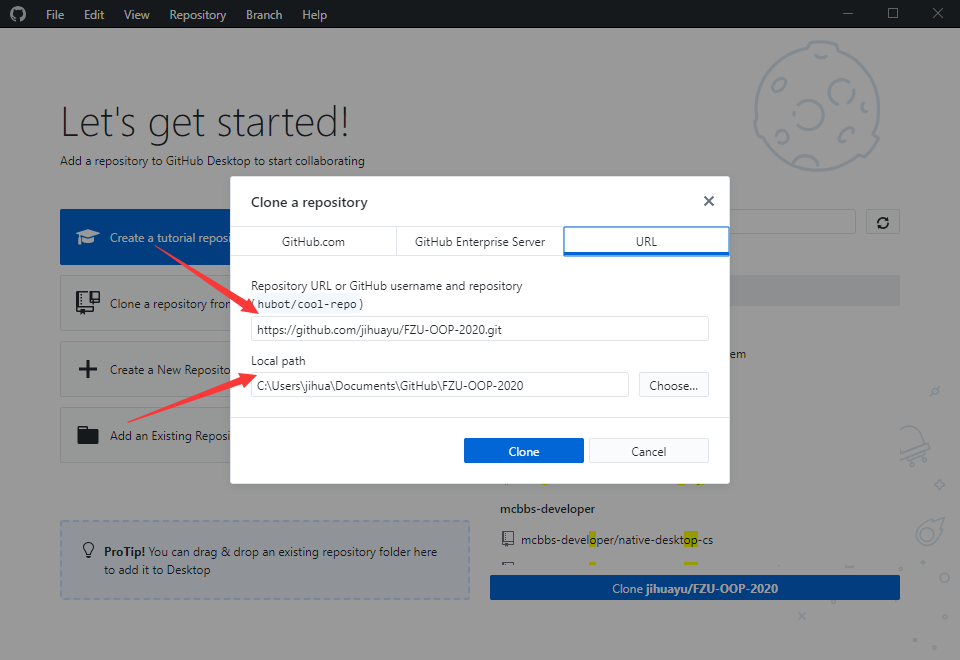
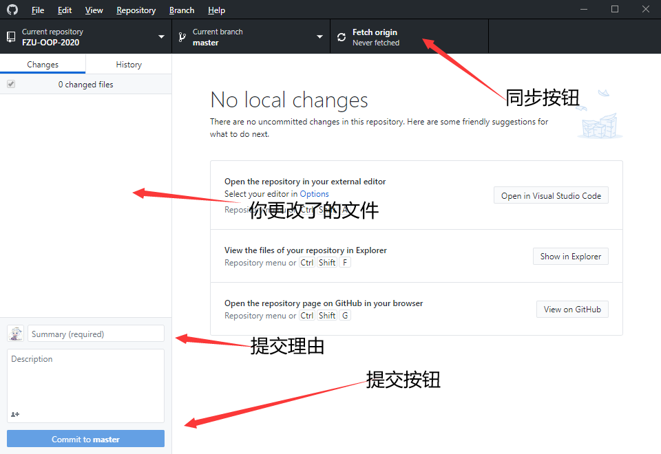

# 基础操作

## 客户端

- 下载[github desktop](https://desktop.github.com/)，并安装。
- 登录

## clone

1. 选择你的项目，点击按钮clone。

2. 选择你clone下的文件夹的位置。

## commit

commit是把本地的仓库提交到本地缓冲区，是提交代码的第一步。

1. 如上图所示，你需要commit时需要先填写提交理由，然后点击提交按钮。

## push

commit是把本地仓库的代码同步到远程。

1. 如上图所示，在你commit后点击同步按钮。

## pull

commit是把远程仓库的代码同步到本地。

1. 如上图所示，点击同步按钮。

